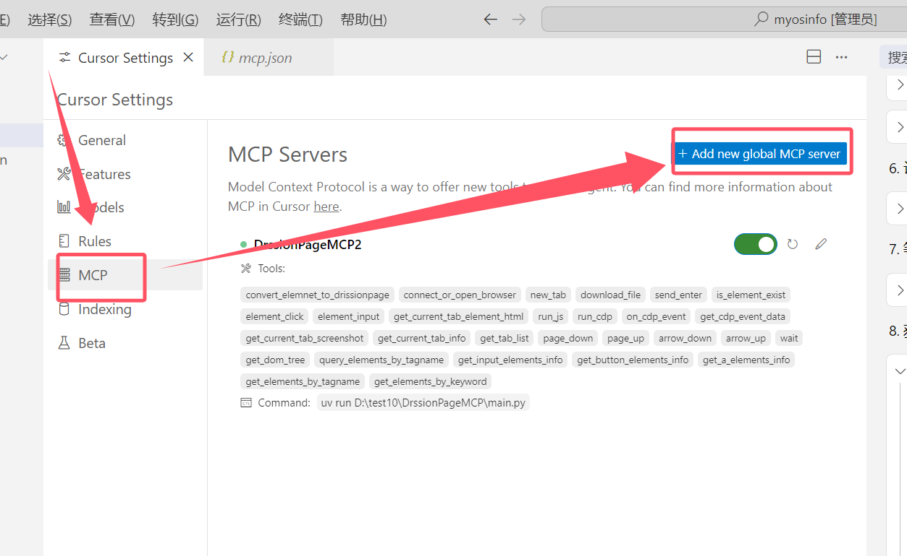
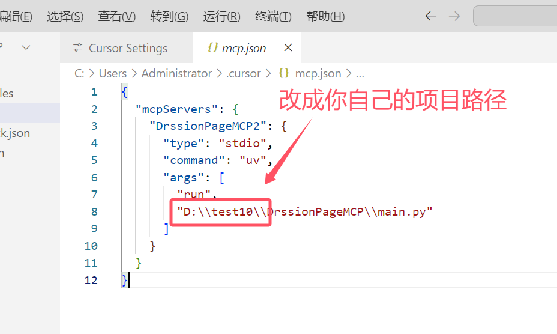
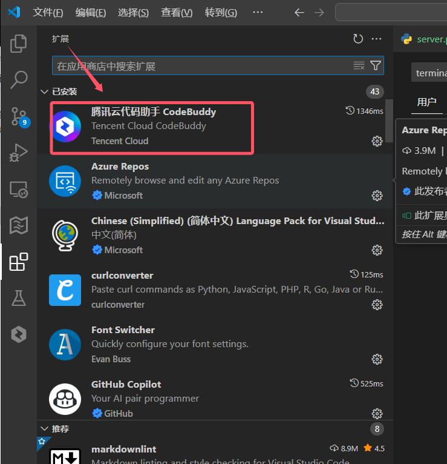
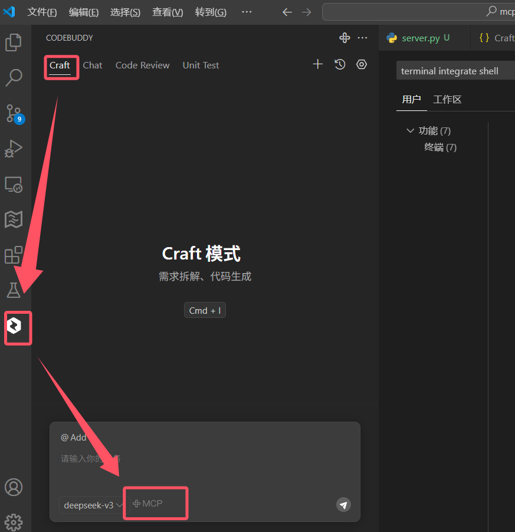
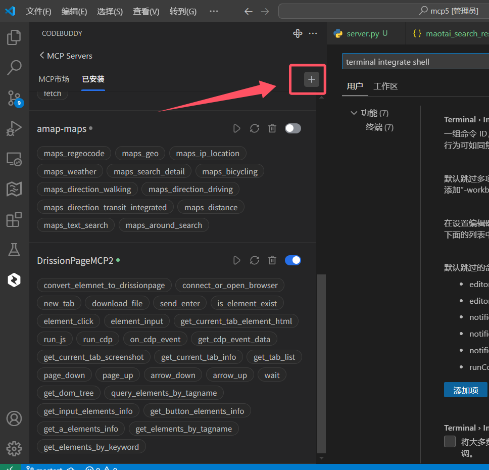

# DrissionPage MCP Server -- 骚神出品

基于DrissionPage和FastMCP的浏览器自动化MCP服务器，提供丰富的浏览器操作API供AI调用。

## 项目简介


DrissionPage MCP  是一个基于 DrissionPage 和 FastMCP 的浏览器自动化MCP server服务器，它提供了一系列强大的浏览器操作 API，让您能够轻松通过AI实现网页自动化操作。

### 主要特性

- 支持浏览器的打开、关闭和连接管理
- 提供丰富的页面元素操作方法
- 支持 JavaScript 代码执行
- 支持 CDP 协议操作
- 提供便捷的文件下载功能
- 支持键盘按键模拟
- 支持页面截图功能
- 增加 网页后台监听数据包的功能
- 增加自动上传下载文件功能

#### Python要求
- Python >= 3.9
- pip（最新版本）
- uv （最新版本）


#### 浏览器要求
- Chrome 浏览器（推荐 90 及以上版本）


#### 必需的Python包
- drissionpage >= 4.1.0.18
- fastmcp >= 2.4.0
- uv

## 安装说明
把本仓库git clone到本地，核心文件是main.py：

### 安装到Cursor编辑器




### 安装到vscode编辑器






请将以下配置代码粘贴到编辑器的`mcpServers`设置中（请填写`你自己电脑上 main.py 文件的绝对路径`）：

```json
{
  "mcpServers": {
    "DrssionPageMCP": {
      "type": "stdio",
      "command": "uv",
      "args": [
        "run",
        "D:\\test10\\DrissionPageMCP\\main.py"
      ],
      "cwd": "D:\\test10\\DrissionPageMCP"
    }
  }
}
```
新增mcp配置 ，填写下面的配置：
``` json
"DrissionPageMCP": {
      "type": "stdio",
      "command": "uv",
      "args": [
        "run",
        "D:\\test10\\DrissionPageMCP\\main.py"
      ],
      "cwd": "D:\\test10\\DrissionPageMCP"
    } 
```

注意事项：
- 请根据实际路径修改`args`中的路径
- Windows中路径中的反斜杠需要转义（使用`\\`）
- 确保`uv`命令在系统PATH中可用
- [《MCP安装参考教程》](https://docs.trae.ai/ide/model-context-protocol)


## 调试命令

调试
```
npx -y @modelcontextprotocol/inspector uv run D:\\test10\\DrssionPageMCP\\main.py
```
或者
```
mcp dev  D:\\test10\\DrssionPageMCP\\main.py
```

## 更新日志
### v0.1.3
增加 自动上传下载文件功能
### v0.1.2
增加 网页后台监听数据包的功能

### v0.1.0

- 初始版本发布
- 实现基本的浏览器控制功能
- 提供元素操作 API
